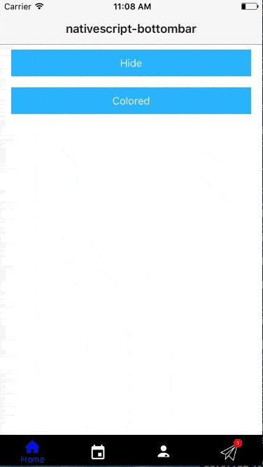
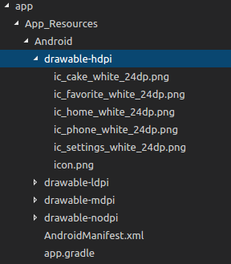

[](https://www.npmjs.com/package/nativescript-bottombar)
[](https://www.npmjs.com/package/nativescript-bottombar)
[](https://twitter.com/_rhanb)
[](https://travis-ci.org/rhanb/nativescript-bottombar)

[](https://nodei.co/npm/nativescript-bottombar/)

# NativeScript BottomBar :beers::fire::fr:


NativeScript plugin for [BottomNavigationView](https://github.com/aurelhubert/ahbottomnavigation) and [UITabBar](https://developer.apple.com/documentation/uikit/uitabbar).

No third libraries are used in this plugin.

 iOS    |  Android
-------- | ---------
 | 

## Installation

`tns plugin add nativescript-bottombar`

# Usage


## Angular NativeScript

### XML
   
```xml
<GridLayout rows="*, auto">
    <StackLayout row="0" orientation="vertical">
       <Label text="demo"></Label>
    </StackLayout>
    <BottomBar row="1" (tabSelected)="tabSelected($event)">
        <BottomBarItem icon="ic_home_black_24dp" title="Home"></BottomBarItem>
        <BottomBarItem icon="ic_calendar" title="Calendar"></BottomBarItem>
        <BottomBarItem icon="ic_collaborator" title="Profile"></BottomBarItem>
		<BottomBarItem icon="ic_paperplane" title="Messages"></BottomBarItem>
    </BottomBar>
</GridLayout>
```
### Component

```typescript
import { Component } from "@angular/core";
import { registerElement } from 'nativescript-angular';
import { BottomBar, BottomBarItemBase } from 'nativescript-bottombar';

registerElement('BottomBar', () => BottomBar);

@Component({
    selector: "ns-app",
    moduleId: module.id,
    templateUrl: "./app.component.html",
    styles: [`
        BottomBar {
            inactive-tint-color: #C34491;
            active-tint-color: #FFFFFF;
            bar-background-color: #9F489B;
        }
    `]
})
export class AppComponent {
    tabSelected(event) {
        console.dir(event);
    }
}
```
## TypeScript NativeScript

### XML

```xml
<Page xmlns="http://schemas.nativescript.org/tns.xsd" loaded="pageLoaded" class="page"
  xmlns:ui="nativescript-bottombar">
  <GridLayout rows="*, 40px" class="page">
    <StackLayout row="0" orientation="vertical">
        <Label text="demo"></Label>
    </StackLayout>
    <ui:BottomBar row="1">
        <ui:BottomBarItem icon="ic_home_black_24dp" title="Home"></ui:BottomBarItem>
        <ui:BottomBarItem icon="ic_calendar" title="Calendar"></ui:BottomBarItem>
        <ui:BottomBarItem icon="ic_collaborator" title="Profile"></ui:BottomBarItem>
		<ui:BottomBarItem icon="ic_paperplane" title="Messages"></ui:BottomBarItem>
    </ui:BottomBar>
</GridLayout>
</Page>
```

### Model

```typescript
import { Observable } from 'data/observable';
import { BottomBar, BottomBarItem, TITLE_STATE, SelectedIndexChangedEventData, Notification } from 'nativescript-bottombar';

export class HomeViewModel extends Observable {

}
```

# Ressources

Don't forget that you need your icons files to be in your ressources folder as follow:


  iOS    |  Android
-------- | ---------
 | 

[API documentation](https://github.com/rhanbIT/nativescript-bottombar/blob/master/API.md)
